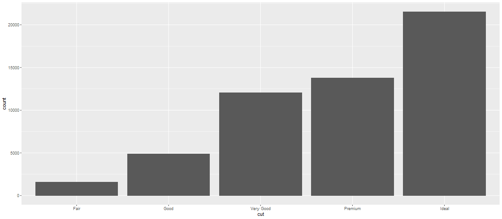
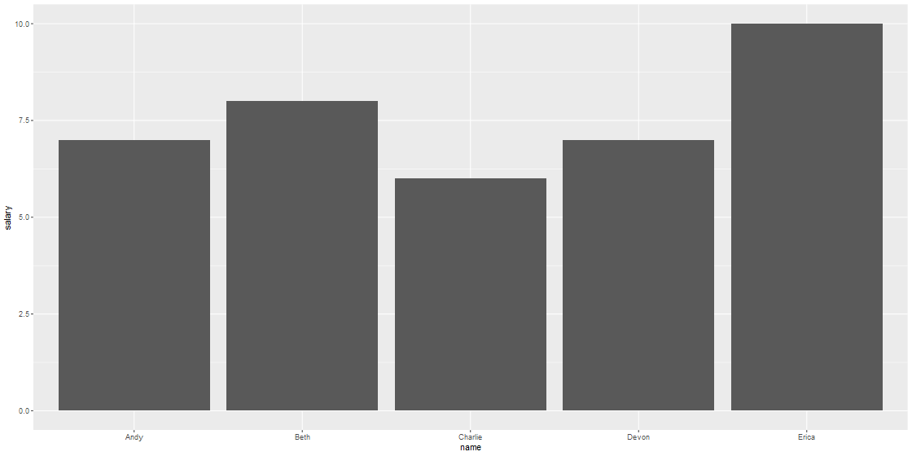
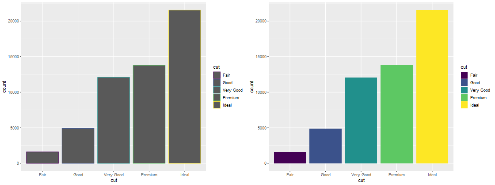
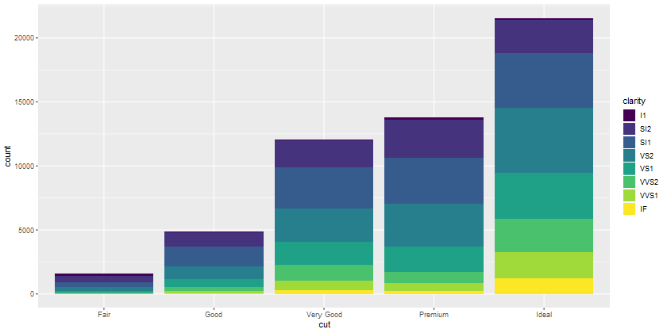
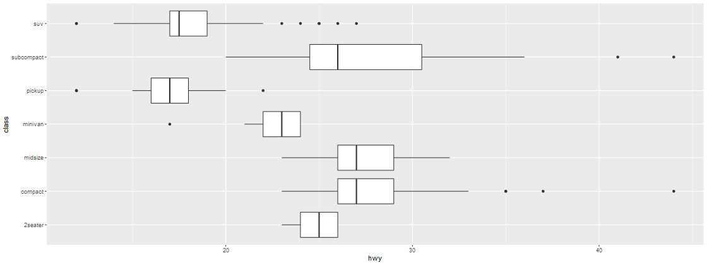
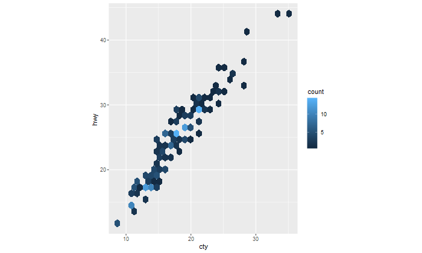
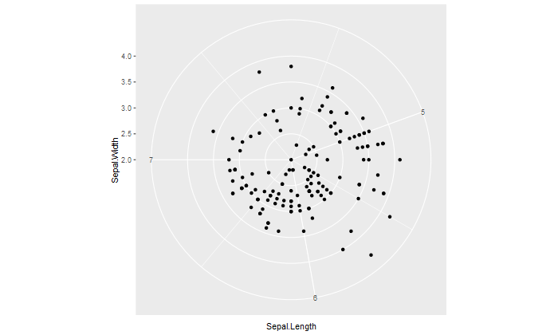
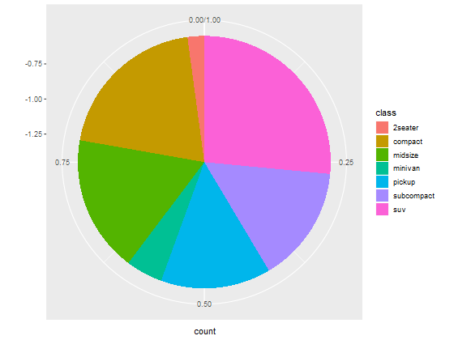

An Introduction to the Tidyverse | Session Five
====================================
author: Tim Hargreaves
date: 2019-10-31
width: 1440
height: 900
css: presentation.css

Recap
====================================
type: section


Tidy Data
====================================

* Tidy data always satisfies three interrelated rules:

  1. Each variable (a value you can measure) must have its own column
  2. Each observation (a thing which has measurable properties) must have its own row
  3. Each value must have its own cell

* Due to the interrelations of these rules we can simplify this to the following two-step procedure:

  1. Put each dataset in tibble
  2. Put each variable in its own column

Dealing With Untidy Data
====================================

* Most untidy data suffers from one of four faults:
  * If our dataset has the values of a variable as columns, we use `gather()`
  * If we have variables contains in the cells of our dataset, we use `spread()`
  * If we have more than one value in a cell, we use `separate()` (or `extract()`)
  * If we have a single value spread across multiple cells, we use `unite()`
* For diagrams and parameter details for these functions, see last session's slides
  
Why Bother?
====================================

* Tidy data does require some initial heavy-lifting
* Once our data is in a tidy form though, further analysis is much simpler
* This means that we can focus more on answering the questions we care about than worrying about what shape our data is in
* The tidyverse is (unsurprising) designed for tidy data and so following this principle lets us utilise its tools much better

Relational Data
====================================

* Multiple tables of data can be combined into one using mutating joins. There are three main types:
  * Inner join - only keep observations featured in both tables
  * Left/right join - only keep observations featured in one table
  * Full join - keep all observations
* We control these joins by specifying a key - (a) shared column(s) between the tables
* Any missing observations have their values filled with `NA`s'
* We join multiple tables by joining each pair one-by-one

Missing Pieces
====================================
type: section

Introduction
====================================

* With course coming to a close, we need to take a quick look at some elements of the tidyverse and R programming in general that we have neglected up until now for simplicity
* These will also help prepare you for the DataViz battle 
* In particular we will have a look at writing R scripts, saving dataframes, and outputting plots

R Scripts
====================================

* So far, most of us have been writing R code directly into the RStudio console
* This works fine for experimental work but can get frustrating if our analyses are long and complex
* It also makes it very difficult to share code with anybody else
* An alternative to this is using R scripts
* We create an R script navigating to `File > New File > R Script` or using `Ctrl-Shift-N`

R Scripts (cont.)
====================================

* This will open a blank text editor in which we can write our R code
* The code will not execute until we tell it to
* We can run a specific command by placing our cursor on it and pressing `Ctrl-Enter`
* We can run our entire script by using the shortcut `Ctrl-Shift-S` (S for Source)
* Alternatively, we can use options from the drop-down 'Run' command in the top bar of the script panel to achieve the same results
* It is good practice to start any script by importing the packages that you use within it

Saving Dataframes
====================================

* If you are working with large datasets or complex pipelines you often won't want to re-run your code
* This can be avoided by saving a copy of a dataframe as a CSV file to be read in again when needed
* We can do this using the `write_csv()` function from `readr`
* This takes two main arguments. The first is the dataframe you wish to save and the second is a path for where to save the file (e.g. 'data/my_data.csv')
* By default, this will overwrite any existing file though you can specify `append = TRUE` to instead append the contents

Outputting Plots
====================================

* Similarly, we can save plots using a `ggplot2` function called `ggsave`
* We don't need to specify an object to save as this will default to using the last displayed plot
* We do however have to specify a file name as the first argument which will be combined with an optional `path` argument
* For example, a file name of 'my_plot.png' and a path of 'output' will create a plot in 'output/my_plot.png'
* There are additional parameters that you may want to specify. It is best to look at the help page for `ggsave` to understand these
* The most important parameters are `device`, `scale`, `width`, `height`, and `dpi`

Advanced Data Visualisation
====================================
type: section

Introduction
====================================
type: sub-section

Where Are We?
====================================

* We've come full circle! 
* Now that we are familiar with the main components of the tidyverse we can return to where we started and look at creating some more interesting visualisations


What is 'Advanced'?
====================================

* This session will still only scratch the surface of `ggplot2`'s potential
* We will however cover quite a few important areas for making exciting and good-looking graphics:
  * Statistical Transformations
  * Positional Adjustments
  * Coordinate Systems
  * Themes
* This is a lot to learn in one session but stick with it. This is the final hurdle

Statistical Transformations
====================================
type: sub-section


A Motivating Example
====================================

* So far we have looked at scatter and line plots
* We can also use ggplot to create bar charts using the `geom_bar()` geometry
* Here we create a bar chart of the cuts in the `diamonds` dataframe


```r
ggplot(data = diamonds) +
  geom_bar(mappping = aes(x = cut))
```

A Motivating Example (cont.)
====================================



* On the x-axis we have a variable we recognise, `cut`, but on the y-axis we have a variable, `count`, that didn't appear anywhere in the original dataset
* Where did this come from?

Stats
====================================

* Simple graphs, like scatter plots and line plots, plot the raw values of the dataset directly
* More complex graphs, such as the bar chart, actually calculate new variables to be plotted:
  * Bar charts, histograms, and frequency polygons bin your data and then plot the bin counts
  * Smoothers (`geom_smooth()`) fit a model to your data and then plot the model predictions
  * Boxplots compute a robust summary of the distribution of your data and then plot this in a specially formatted way
* The algorithm used to calculate new values for a graph is called a **stat** (short for statistical transformation)

Stats (cont.)
====================================

* We can find out which stat a particular geom uses by looking at the corresponding help page
* For example the help page for `geom_bar()` states that the default value for the `stat` parameter is "count"
* `stat_count()` is documented on the same page as `geom_bar()`
* If you scroll down and look the section titled 'Computed Variables', we can see that it computes two new variables, `count` and `prop`
* Every geom has a default stat so we rarely need to worry about about the underlying statistical transformation
* There are times however when we will want to be aware of what is taking place under-the-hood

Overriding Stats
====================================

* Sometimes you may wish to override the default stat choice for a geom
* For example we may want to create a bar chart using `stat_identity()` instead of `stat_count()`
* When we do this we supply a `y` aesthetic and no statistical transformation takes place


```r
salaries <- tribble(
  ~name,     ~salary,
  "Andy",     7,
  "Beth",     8,
  "Charlie",  6,
  "Devon",    7,
  "Erica",    10
)

ggplot(data = salaries) +
  geom_bar(mapping = aes(x = name, y = salary), stat = "identity")
```

Overriding Stats (cont.)
====================================



* Note that we could have instead used `geom_col()`
* This behaves just like `geom_bar()` but has a default stat of `stat_identity`

Overriding Mappings
====================================

* We can also override the default mapping from transformed variables to aesthetics
* For example, we can display a bar chart of proportion rather than count


```r
ggplot(data = diamonds) +
  geom_bar(mapping = aes(x = cut, y = ..prop.., group = -1))
```


* As you can see, we access computed variables using the notation `..var_name..`

More Geometries
====================================

* Now that we have an idea about how stats in `ggplot2` behave, we can introduce some more geometries:
  * One variable - `geom_area()`, `geom_density()`, `geom_freqpoly()`, `geom_histogram()`, `geom_bar()`
  * Two variables (both continuous) - `geom_label()`, `geom_text()`, `geom_rug()`
  * Two variables (one discrete) - `geom_col()`, `geom_boxplot()`, `geom_violin()`
  * Two variables (both discrete) - `geom_count()`
  * Two variables (bivariate) - `geom_bin2d()`, `geom_density2d()`, `geom_hex()`
* You can find which aesthetics these geometries require and accept by looking at their help pages

Position Adjustments
====================================
type: sub-section

Colouring Bar Charts
====================================

* Whereas `geom_point()` and `geom_line()` had their colours controlled entirely by the `col` (or `color`/`colour`) aesthetic bar charts have two aesthetics for colour
* `col` is used for the outline colour of each bar and `fill` is used for the interior colour


```r
ggplot(data = diamonds) + geom_bar(mapping = aes(x = cut, colour = cut))
ggplot(data = diamonds) + geom_bar(mapping = aes(x = cut, fill = cut))
```



Stacked Bars
====================================

* What happens when we map the fill aesthetic to one other than that being using for `x`?
* We end up with a stacked bar chart!


```r
ggplot(data = diamonds) +
  geom_bar(mapping = aes(x = cut, fill = clarity))
```



* Note: The same also happens if we use the colour aesthetic though the result is less visually-pleasing

Setting Position
====================================

* This is because the default value of the `position` parameter for `geom_bar` is "stack"
* If we didn't like this behaviour we have "identity", "dodge", and "fill" to choose from
* "identity" will place each object exactly where it would normally fall in the graph. This will cause bars to overlap and so this should only be used with `alpha` set to a low value or with `fill = NA` and an outline colour
* "dodge" places overlapping objects side-by-side. This makes it easy to compare individual observations but obscures the group behaviour
* "fill" works like "stack" but makes each set of stacked bars the same height. This makes it easier to compare the breakdown of each group
* You may wish to experiment with these options by adjusting the code on the last slide

Setting Position (cont.)
====================================

* Here is one example (though not a pretty one) using `position = "identity"`


```r
ggplot(data = diamonds) +
  geom_bar(mapping = aes(x = cut, colour = clarity), fill = NA, position = "identity")
```


Jittering
====================================

* Scatterplots also have their own position parameter (which defaults to "identity")
* Another option is "jitter"
* This is used to reduce over-plotting by adding a slight bit of random noise to the position of each point
* This is especially useful when you are dealing with rounded data or discrete variables
* Alternatively you can use `geom_jitter()` which is the same as `geom_point()` but has a default position argument of "jitter"

Coordinate Systems
====================================
type: sub-section

Switching Axes
====================================

* You can switch the x and y axes of a plot by adding a call to `coord_flip()` as a new layer
* This is useful when you have long labels on the x-axis that would otherwise overlap


```r
ggplot(mpg, aes(x = class, y = hwy)) +
  geom_boxplot() +
  coord_flip()
```



Fixing Axis Ratio
====================================

* By default, ggplot will scale a graph so it fills your plotting window
* You can override this behaviour and force a specific ratio using `coord_fixed(ratio = ...)`


```r
ggplot(mpg, aes(x = cty, y = hwy)) +
  geom_hex() +
  coord_fixed(ratio = 1)
```



Polar Coordinates
====================================

* You can use `coord_polar()` to treat your x and y values as r and theta in polar coordinates


```r
ggplot(iris, aes(x = Sepal.Length, y = Sepal.Width)) +
  geom_point() +
  coord_polar()
```



* It seems like there is very little point to this but this is actually how you would go about creating a pie, Coxcomb or radar plot

Pie Charts
====================================


```r
ggplot(mpg, aes(x = -1, fill = class)) +
  geom_bar(position = 'fill') +
  coord_polar("y") +
  labs(x = "")
```



* The other visual artifacts can be removed with a little work

Themes
====================================
type: sub-section

Complete Themes
====================================

* ggplot comes with several complete themes which control all non-data display
* The default theme is `theme_default()` - which ironically is one of the ugliest
* You can find a list of all themes by looking at the help page for any theme (i.e. `?theme_default`)
* Some good-looking themes to try out include `theme_grey()`, `theme_bw()`, and `theme_minimal()`
* You can change the theme of a plot by adding a theme function as a new layer


```r
ggplot(diamonds, aes(x = cut, y = price, fill = cut)) +
  geom_violin(alpha = 0.5, show.legend = FALSE) +
  coord_flip() +
  theme_minimal()
```

Default Themes
====================================

* The default theme for each plot you create can be found by calling `theme_get()`
* At the start of a new R session, this will always be `theme_classic()`
* You can override this default by using, say, `theme_set(theme_minimal())`
* `theme_set()` returns the old theme when called
* It is good practice to use `old_theme <- theme_set(theme_minimal())` so that the original theme can be restored if needed

Theme Components
====================================

* You can adjust individual components of a theme by adding a `theme()` layer
* This function can take hundreds of parameters, each corresponding to a unique element of the plot
* You can find a list by using `?theme`
* For each parameter we pass in one of `element_blank()` (remove the element), `element_rect()`, `element_line()`, `element_text()`
* We can then specify ways of theming the element in this function
* You can look at the relevant help page for each element type to see a list of valid parameters
* For example we can make the x-axis label red using `theme(axis.text.x = element_text(colour = 'red'))` as a new layer

Summary
====================================
type: sub-section

A Layered Grammar of Graphics
====================================

* We have covered a lot about `ggplot2` in the several session involving it
* This foundation is powerful enough to produce essentially any type of plot you can imagine
* We can summarise all we have learnt into the following template


```r
ggplot(data = <DATA>) + 
  <GEOM_FUNCTION>(
     mapping = aes(<MAPPINGS>),
     stat = <STAT>, 
     position = <POSITION>
  ) +
  <COORDINATE_FUNCTION> +
  <FACET_FUNCTION> +
  <THEME_FUNCTION>
```

* Note that the geom and theme functions can actually be multiple geoms and themes layered one on top of the other

Going Further
====================================

* Although ggplot is an immensely powerful tool, it does have limitations
* Thankfully, the ggplot ecosystem is entirely extensible
* Here are a few extensions that may be of interest:
  * `gganimate` - turn static `ggplot2` plots into animations using only a few lines of code
  * `ggthemes` - more themes, more geometries, more scales
  * `ggrepel` - repel overlapping text labels away from each other
  * `geofacet` - create facets that map to real-life geography

The DataViz Battle
====================================
type: sub-section

Congratulations
====================================

* Well done for making it to the end of the structured portion of this course
* It is now time to apply the skills you developed to produce a data visualisation of your choosing
* We will not be running a session next week so you have time to work on this
* We will then reconvene in two weeks time to showcase results

Competition Rules
====================================

* Each student is allowed to enter as many visualisations as they would like
* You are welcome to work together and help each other with problems but should not copy code directly
* The visualisation you produce can be _inspired_ by existing visualisations/projects but direct plagiarism will not be tolerated (it is safest to comment your code with where you got certain ideas/code from)
* You are welcome to ask me for any support during the competition. I will be able to guide you to helpful resources and/or fix errors in your code

Prizes
====================================

* Anyone who participates in the competition will be rewarded with a tidyverse laptop sticker
* There will be four main prizes each earning a box of chocolates:
  * Most aesthetically-pleasing visualisation
  * Visualisation showcasing the best techniques that go above and beyond this course
  * Best story-telling/most informative
  * Novel visualisation of the weather dataset
* Each visualisation entered can only win one of these prizes but if you decide to enter all four categories with four different visualisations, you could potentially win them all

Submitting Visualisations
====================================

* To submit a visualisation, please email a compressed archive (e.g. ZIP) to `tim.hargreaves@icloud.com`
* This should contain the output of your visualisation (any file format welcome), the R Script that produced your visualisation, and any inputs your script requires (e.g. data sets)
* This must be sent to be by 1pm on the 27th November to be considered for the main prizes
* I will consider visualisations sent to me at any point for the participation prizes
* By submitting your visualisation, you must agree to have its source code and output hosted on this course's GitHub repository (I am happy to help you clean up your code/visualisation before it is shared)

Resources
====================================

* As stated in session one, there are many ways to access resources on the tidyverse
* [Stack Overflow](https://stackoverflow.com/) is a great resource - avoid asking your own questions as almost every beginner question has already been asked
* Simply web-searching your problem followed by one of 'R', 'Tidyverse', or the specific tidyverse package you are using will return you many helpful guides
* The tidyverse has a [website](https://www.tidyverse.org/) with help guides, tutorials, and full documentation
* You can also check out the [cheat sheets](https://www.rstudio.com/resources/cheatsheets/) for each of the packages we're using, though these are quite in-depth
* Best of luck!
