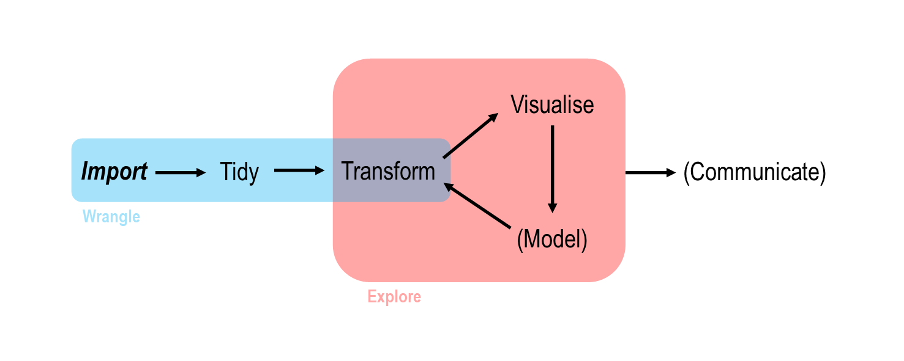
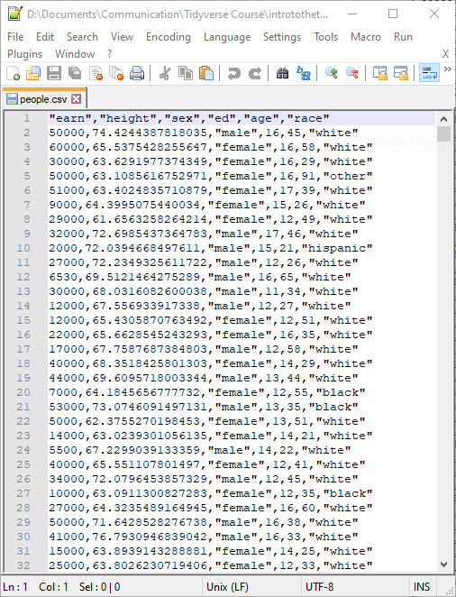
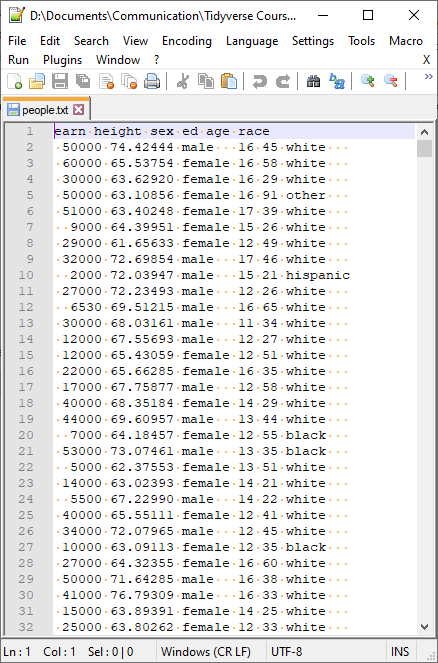

An Introduction to the Tidyverse | Session Two
====================================
author: Tim Hargreaves
date: 2019-10-03
width: 1440
height: 900
css: presentation.css


Recap
====================================
type: section

Basic Scatter Plots
====================================

* The basic structure of the code needed to generate a scatter plot is


```r
ggplot(data = <DATA>) +
  <GEOM_FUNCTION>(mapping = aes(x = <VAR1>, 
                                y = <VAR2>, 
                                <FURTHER MAPPINGS>))
```

* Further mappings include `col`/`colour`/`color`, `size`, `alpha`, `shape`
* We manually set aesthetics by placing them outside of `aes()`

Faceting
====================================

* We can facet a plot in one of two ways


```r
ggplot(data = <DATA>) +
  <GEOM_FUNCTION>(mapping = aes(<MAPPINGS>)) +
  facet_wrap(~ <VAR>)
```


```r
ggplot(data = <DATA>) +
  <GEOM_FUNCTION>(mapping = aes(<MAPPINGS>)) +
  facet_grid(<ROW_VAR> ~ <COL_VAR>)
```

Working with Data Frames
====================================

* Useful functions for inspecting dataframes are
  * `head()`, `tail()`,
  * `summary()`
  * `str()`
  * `$`, `[[...]]`
* We get more information about a dataset using `?dataset_name`

Back to the Basics
====================================
type: section

Introduction
====================================

* We now have some experience with running R code
* But there is still a lot that we have not covered
* Here we cover some fundamentals of coding with R
* I'll also offer some tips and tricks for using RStudio

Coding Basics
====================================
type: sub-section

R as a Calculator
====================================

* We have already seen that R can be used as a basic calculator 
* This functionality extends beyond basic arithmetic


```r
(58 + 73 * 2) / 3  # normal rules of BIDMAS apply
```

```
[1] 68
```


```r
sin(pi / 2)
```

```
[1] 1
```


```r
sqrt(81)
```

```
[1] 9
```


```r
log(42)  # natural logarithm - also called ln()
```

```
[1] 3.73767
```

Objects
====================================

* R is capable of storing any value in an *object* (also called variables)
* Objects are simply a way of labelling a piece of data for later use
* In R, objects are *assigned* using the `<-` operator


```r
x <- 3 * 4
```

* Once an object has been assigned a value, it can be referenced by using its name


```r
x
```

```
[1] 12
```


```r
x / 2
```

```
[1] 6
```

Objects (cont.)
====================================

* All R statements where you create objects have the form


```r
object_name <- value
```

* An object will retain its value until one of the following occur:
  * You close RStudio
  * You delete the object manually
  * You *overwrite* its value with another
* You can see a list of all objects in the 'Environment' pane in RStudio
* Many programming languages use the `=` symbol for assignment and R will accept this too; this will however cause confusion later, so please avoid doing so
* If you are getting tired of tying `<-` you can use the keyboard shortcut `alt-minus` in RStudio to insert it

What's in a Name?
====================================

* Object names must start with a letter, and can only contain letters, numbers, `_`, and `.`
* A good object name will be descriptive and follow the same convention as the rest of your code
* Don't be afraid of long variable names! RStudio is capable of code completion. Simply type the first few letters of a variable name (or function, for that matter), press `TAB`, select the correct name from the drop-down list, and press `ENTER`.
* Beware: Object names in R are case-sensitive and are intolerant to typos!

Aside: Code History
====================================

* When typing in the console, you can use the up and down arrow keys to jump between previously entered lines of code
* This is especially helpful if you made a mistake in a line of code and which to correct it before re-running
* You can see your full code history in the 'History' pane in RStudio

Functions
====================================
type: sub-section

Calling Functions
====================================

* R has a large collection of built-in functions that are called like this:


```r
function_name(arg1 = val1, arg2 = val2, ...)
```

* An example of such a function is `seq()` which makes a regular **seq**uence of numbers


```r
seq(from = 1, to = 10)
```

```
 [1]  1  2  3  4  5  6  7  8  9 10
```

* For many functions, it is unnecessary to name the arguments as there is an obvious order that they should be entered in


```r
seq(1, 10)
```

```
 [1]  1  2  3  4  5  6  7  8  9 10
```

* There are ways to check which functions allow this, but for now, trial and error plus some common sense will suffice

Common Problems
====================================

* If the symbol at the start of the R console changes from a `>` to a `+` then it means that R is expecting more input. Perhaps you forgot to close a bracket. If you can't find how to make R happy, you can press the `ESC` key to exit the current statement and start afresh.
* If you receive an `object not found` error then it is most likely that you've made a typo or have forgotten to assign a value to a variable you are referencing
* If you are unsure of what arguments a specific function takes, have a look at the relevant help page using the `?` operator

Data Import
====================================
type: section

Introduction
====================================
type: sub-section

Where Are We?
====================================

* Now that we have the basics of data visualisation under our belt, we can return to the beginning of the data science pipeline
* In doing this, we are departing from the order that R4DS takes, although I think this is best so we can get our hands on the weather dataset



What is readr?
====================================
left: 70%

* `readr` is another of the many packages included in the tidyverse
*  It allows you to import data from a wide variety of storage formats
*  It is designed to balance import speed, ease-of-use, and consistency

***


First Steps
====================================
type: sub-section

CSV files
====================================
left: 50%

* Common-separated value (CSV) files are almost certainly the most common storage format for flat data
* Each observation occupies its own line and fields are separated by commas (hence the name)
* CSVs can contain a header row with column names, although this is not always the case

***



Importing CSV files
====================================

* You can import a CSV file using the `read_csv()` function
* Don't forget to import the `tidyverse` package first!
* The first argument is the most important; it's the path to the file to read
* The path of the file should be relative to your current *working directory*
* This can be changed using `Session > Set Working Directory > Choose Directory` or by using `Ctrl+Shift+H`


Importing CSV files (cont.)
====================================


```r
people_df <- read_csv("data/people.csv")
```

```
Parsed with column specification:
cols(
  earn = col_double(),
  height = col_double(),
  sex = col_character(),
  ed = col_double(),
  age = col_double(),
  race = col_character()
)
```

* When using the `read_csv()` function, you are outputted a message containing the column names and types
* Warning: Don't confuse `readr`'s `read_csv()` function with the built-in `read.csv()` function

Importing CSV files (cont.)
====================================


```r
people_df
```

```
# A tibble: 1,192 x 6
    earn height sex       ed   age race    
   <dbl>  <dbl> <chr>  <dbl> <dbl> <chr>   
 1 50000   74.4 male      16    45 white   
 2 60000   65.5 female    16    58 white   
 3 30000   63.6 female    16    29 white   
 4 50000   63.1 female    16    91 other   
 5 51000   63.4 female    17    39 white   
 6  9000   64.4 female    15    26 white   
 7 29000   61.7 female    12    49 white   
 8 32000   72.7 male      17    46 white   
 9  2000   72.0 male      15    21 hispanic
10 27000   72.2 male      12    26 white   
# ... with 1,182 more rows
```

Aside: Tibbles
====================================

* Tibbles are just standard R data frames, but they tweak some old behaviours to make life a little easier
* For example, Tibbles limit how many rows and columns are printed in one go to avoid flooding the console
* They also give you useful tips such a column types and the dimension of the data frame
* A standard R data frame can be converted to a tibble using the `as_tibble()` function


```r
mtcars_tb <- as_tibble(mtcars)
```

In-line CSV files
====================================

* For the purposes of testing code, the `read_csv()` function can process an in-line CSV
* This is also important for creating reproducible examples


```r
read_csv(
  "a, b, c
   1, 2, 3
   4, 5, 6"
)
```

```
# A tibble: 2 x 3
      a     b     c
  <dbl> <dbl> <dbl>
1     1     2     3
2     4     5     6
```

readr Parameters
====================================
type: sub-section

Skipping Rows
====================================

* As seen in both previous examples, the default behaviour for `read_csv()` is to use the first line for column names
* This convention can be circumvented by using either the `skip` or `comment` parameter 

Skipping Rows (cont.)
====================================

* The `skip` parameter can be used to skip a specified number of rows in the CSV file before starting to read data
* This is useful when your CSV contains metadata at the top of the file


```r
read_csv(
  "The first line of metadata
   The second line of metadata
   x, y, z
   1, 2, 3",
  skip = 2
)
```

```
# A tibble: 1 x 3
      x     y     z
  <dbl> <dbl> <dbl>
1     1     2     3
```

Skipping Rows (cont.)
====================================

* The `comment` parameter can be used to drop all lines starting with a specified character


```r
read_csv(
  "# This line is a comment
   x, y, z
   # So is this one
   1, 2, 3",
  comment = '#'
)
```

```
# A tibble: 1 x 3
      x     y     z
  <dbl> <dbl> <dbl>
1     1     2     3
```


Manual Column Names
====================================

* It may be the case that the CSV file you are importing does not have column names
* In this case you can use the `col_names` parameter to control what to do

Manual Column Names (cont.)
====================================

* Setting `col_names = FALSE` will tell `read_csv()` that the first row of the CSV file is data and that the column should be labelled using generic names 'X1', 'X2', etc.


```r
read_csv(
  "1, 2, 3
   4, 5, 6",
  col_names = FALSE
)
```

```
# A tibble: 2 x 3
     X1    X2    X3
  <dbl> <dbl> <dbl>
1     1     2     3
2     4     5     6
```

Manual Column Names (cont.)
====================================

* Alternatively, if you know what the column names should be, you can specify then using a *character vector*


```r
read_csv(
  "1, 2, 3
   4, 5, 6",
  col_names = c("x", "y", "z")
)
```

```
# A tibble: 2 x 3
      x     y     z
  <dbl> <dbl> <dbl>
1     1     2     3
2     4     5     6
```

Aside: Vectors
====================================

* In R, a vector is a collection of elements of the same type
* There are integer vectors, character vectors, *double* vectors, and many more
* Vectors are created using the `c()` function. This stands for **c**ombine


```r
x <- c(1, 4, 9)
```

* Most mathematical functions in R act element-wise on vectors


```r
sqrt(x)
```

```
[1] 1 2 3
```

* A particular value of a vector can be accessed using the `[` accessor


```r
x[2]  # R uses 1-based-indexing
```

```
[1] 4
```

Missing Values
====================================

* In the real world, it is rare to ever have a complete data set
* Missing values can be encoded using a range of symbols - `.`, `?`, `N/A`, `-`, etc.
* You can tell `readr()` which symbol is used in a given CSV file using the `na` parameter


```r
read_csv(
  "x, y, z
   1, 2, .
   4, ., 6",
  na = '.'
)
```

```
# A tibble: 2 x 3
      x     y     z
  <dbl> <dbl> <dbl>
1     1     2    NA
2     4    NA     6
```

Summary
====================================

* With these few techniques, one is most likely capable of reading about 75% of all CSV files that come up in 'the wild'
* These techniques easily be adapted for use with other `readr` functions

More readr Functions
====================================
type: sub-section

More Delimited Files
====================================

* `read_csv2()` - semicolon-separated files
* `read_tsv()` - read tab-separated files
* `read_delim()` - reads files with any delimiter


```r
read_delim('path/to/file.txt', '|')
```

* These all accept the same additional arguments as `read_csv()`

Fixed-width files
====================================
left: 50%

* Some flat data files do not have separators but instead have the same width for each observation of a given field
* These are usually separated by spaces but other characters can be used

***



Importing fixed-width files
====================================

* You can import a fixed-width file using the `read_fwf()` function
* This behaviours very similar to `read_csv()` although column names *must* be specified manually
* The second argument of `read_fwf()` can be `fwf_widths()`. This then takes a vector of integers to represent the widths of the columns and an optional vector of column names


```r
people <- read_fwf('data/people.txt', 
                   fwf_widths(c(6, 9, 7, 3, 3, 9), 
                              c('earn','height','sex','ed','age','race')),
                   skip = 1)
```

```
Parsed with column specification:
cols(
  earn = col_double(),
  height = col_double(),
  sex = col_character(),
  ed = col_double(),
  age = col_double(),
  race = col_character()
)
```

Importing fixed-width files (cont.)
====================================


```r
people
```

```
# A tibble: 1,192 x 6
    earn height sex       ed   age race    
   <dbl>  <dbl> <chr>  <dbl> <dbl> <chr>   
 1 50000   74.4 male      16    45 white   
 2 60000   65.5 female    16    58 white   
 3 30000   63.6 female    16    29 white   
 4 50000   63.1 female    16    91 other   
 5 51000   63.4 female    17    39 white   
 6  9000   64.4 female    15    26 white   
 7 29000   61.7 female    12    49 white   
 8 32000   72.7 male      17    46 white   
 9  2000   72.0 male      15    21 hispanic
10 27000   72.2 male      12    26 white   
# ... with 1,182 more rows
```

* These can be read in alternative ways using `fwf_positions()`, `fwf_cols()`, and `fwf_empty()`
* See `?read_fwf` to learn more

Importing fixed-width files (cont.)
====================================

* When a fixed-width file has columns separated by white-space, you can use the `read_table()` function
* This will automatically guess the column positions so you only need to enter a path to a file
* However, it isn't always the smartest when the file has a header so it is best to skip the header and manually specify the column names


```r
people <- read_table('data/people.txt', 
                     skip=1, 
                     col_names = c('earn','height','sex','ed','age','race'))
```

```
Parsed with column specification:
cols(
  earn = col_double(),
  height = col_double(),
  sex = col_character(),
  ed = col_double(),
  age = col_double(),
  race = col_character()
)
```

Column Types
====================================
type: sub-section

Manual Column Types
====================================

* R4DS now spends a dozen or so pages discussing how to control the parsing of column types
* This is worth a read if you're interested but I will summarise the main points in a few slides

* `readr` uses a heuristic to figure out the type of each column from the first 1000 rows
* This means that it can sometimes get these wrong
* In this case, it is worth re-importing but with column types specified manually
* The most common issues are integers being read as *doubles*, factors (categorical variables) being read as strings, or dates being read as strings

Manual Column Types (cont.)
====================================

* You can manually specify column types using the `col_types` parameter with the `cols()` function


```r
people <- read_csv('data/people.csv',
                   col_types = cols(
                     earn = col_double(),
                     sex = col_factor(),
                     age = col_integer()
                   ))
```

* Any columns not specified will be guessed
* A column can be skipped by setting its type to `col_skip()`
* Valid column types are `logical`, `integer`, `double`, `character`, `factor`, `date`, `time`, `datetime`, `number` (this is only used in special cases)

(A Tiny Bit More) Data Visualisation
====================================
type: section

More Geometries
====================================
type: sub-section

Line plots
====================================

* So far, we have only produced scatter plots and that's a bit boring
* By changing which geometry we use, we generate a line plot
* A dataset suited to this type of graph is the oranges dataset


```r
Orange <- as_tibble(Orange)
head(Orange)
```

```
# A tibble: 6 x 3
  Tree    age circumference
  <ord> <dbl>         <dbl>
1 1       118            30
2 1       484            58
3 1       664            87
4 1      1004           115
5 1      1231           120
6 1      1372           142
```

* How would we learn more about the `Orange` dataset?

Line plots (cont.)
====================================

* A line plot is produced by using the `geom_line()` geometry
* Note that I am specifying parameters by position rather than by name


```r
ggplot(Orange) +
  geom_line(aes(x = age, y = circumference, col = Tree), size = 2)
```


Smooth Fitted Lines (cont.)
====================================

* A similar geometry is `geom_smooth()`. This adds a smooth fitted line to a plot
* This can be combined with `geom_point()` to create the following graph
* Use can use the `se` parameter to control whether confidence intervals are shown. These are best turned off for now


```r
ggplot(Orange) +
  geom_smooth(aes(x = age, y = circumference, col = Tree), size = 2, se = FALSE) +
  geom_point(aes(x = age, y = circumference, col = Tree), size = 2)
```


Global Aesthetics
====================================

* The previous code is repetitive as we specify the mapping for aesthetics `x`, `y`, and `col` twice
* We can instead specify these as the second argument of `ggplot()`
* These will be treated as global variables mappings
* You can still specify local mappings in either of the geometry functions


```r
ggplot(Orange, aes(x = age, y = circumference, col = Tree)) +
  geom_smooth(size = 2, se = FALSE) +
  geom_point(aes(size = circumference))
```


Aesthetics for line graphs
====================================

* Both line graph geometries both come with a `linetype` aesthetic to control what type of line is used
* This should have a categorical variable mapped to it or manually set to a positive integer value/[name of a line type](http://www.sthda.com/english/wiki/ggplot2-line-types-how-to-change-line-types-of-a-graph-in-r-software)
* Both aesthetics also has a `group()` aesthetic which allows you to separate the full data set before generating the lines (see exercises for examples of this)
* This can be set to `-1` to use no grouping
